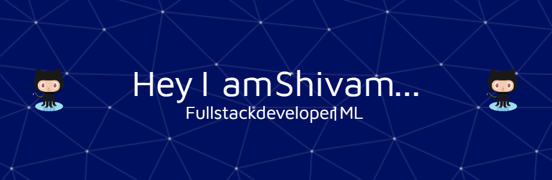
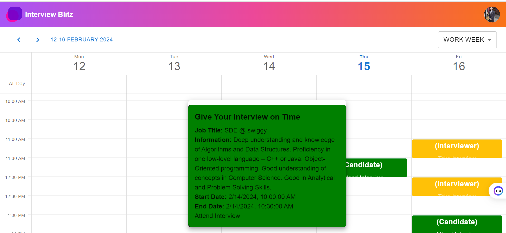
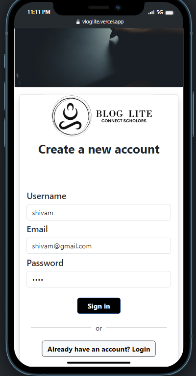

# Shivam Singh

<h3 align="center">A passionate  developer from India</h3>

## Contact Information
- **Email:** shivam2003sy@gmail.com
- **Phone:** 8542802233

## Education
- **B.S in Data Science and Application**
  - *Indian Institute of Technology Madras, Chennai*
  - *CGPA:* 7.5
- **B.Tech in Computer Science**
  - *IET, Bundelkhand University, Jhansi*
  - *CGPA:* 8.0
## Scholastic Achievements
- Smart India Hackathon Winner 2023 (ISRO)
- Smart India Hackathon Winner 2022 (Ministry of Jal Shakti)
- Google HashCode Competition Rank 1797
- Attended Innovation, Design, and Entrepreneurship (IDE) Bootcamp by Gov. of India

## Relevant Courses and Skills
### Application Development
- **Frontend:** HTML/CSS, JavaScript, React, Vue.js
- **Backend:** Python, Flask, Celery, Redis, PostgreSQL
- **Mobile:** React Native
- **Version Control:** Git, GitHub

### Machine Learning
- **Skills:** Linear Algebra, Statistics, ML Algorithms, Deep Learning, Reinforcement Learning
- **Libraries:** scikit-learn, Pandas, NumPy, Matplotlib, Seaborn

### Big Data & Other Tools
- **Tools:** Kafka, Hadoop, Apache Spark, Tableau
- **Cloud:** Google Cloud Platform
- **Certification:** NPTEL Certificate Course - Cloud Computing

## Professional Experiences (Internships)
### Product Developer (Ministry of Jal Shakti, Central Ground Water Board)
- Led development of user-friendly graphic interface using Electron.js and React.js
- Contributed to water quality analysis application

### Full Stack Developer (Somadisha Consultants and Solutions Pvt. Ltd) (1+ year )
- Developed React Native Android app called HashX
- Proficient in ReactJS, React Native, Supabase

### Frontend Developer (Shiksha-Sopan, IIT Kanpur)
- Contributed to development of Full Naest project, an online examination platform
- 
## Interests
Outside of tech, I enjoy Playing chess, participating in hackathons . I’m always eager to learn and tackle new challenges.

## Hosted Projects

1. [InterviewBlitz](https://interview-blitz.vercel.app/) - A platform to Test, Interview, and Hire in a fast-forward way! 

##### Features

-  Schedule Interviews :  Easily schedule interviews for technical positions within the app.

- Customized Testing Criteria : Define specific testing criteria for each technical post to assess candidates effectively.

- Automated Scoring  :Our automated scoring system assigns marks to candidates based on their performance in each criterion.

- Detailed Reports :Generate detailed reports for candidates and interviewers to identify strengths and areas for improvement.

- Seamless Communication : Facilitate communication between interviewers and candidates throughout the process.

- Main Interview Module  : Conduct interviews efficiently with a user-friendly interface.

- Future Enhancements : Continuous improvement with upcoming features such as advanced analytics and integration with applicant tracking systems.
- 

*Screenshot of the InterviewBlitz platform.*

1. [Bloglite](https://vloglite.vercel.app/) - Blog lite is similar to social media site for sharing thoughts with images  with like , comment ,   Cache  , redis   ,  mail  ,  jwt auth etc.
   
<!-- 
2. [Online Store](https://example.com/store) - An e-commerce website selling handmade crafts.
    -->

Feel free to explore these websites and reach out to me if you have any questions or feedback!

  

  

  

<h3 align="left">Connect with me:</h3>

<h3 align="left">Languages and Tools:</h3>

                                      

<h3 align="left">Support:</h3>

  

## GitHub Stats & Tools

